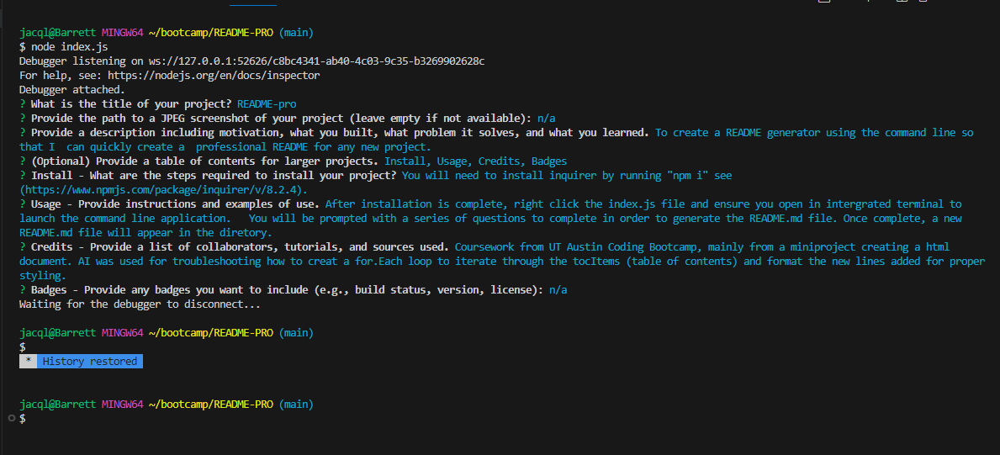

# README-pro

## Description
To create a README generator using the command line so that I  can quickly create a  professional README for any new project. 

Demo Video: https://drive.google.com/file/d/18ulvTNRnBivc14EU6DQ3z186gGtQwxHQ/view

## Table of Contents
  - [Install](#install)
  - [Usage](#usage)
  - [Credits](#credits)
  - [Badges](#badges)

## Install
You will need to install inquirer by running "npm i" see (https://www.npmjs.com/package/inquirer/v/8.2.4). 

## Usage
After installation is complete, right click the index.js file and ensure you open in intergrated terminal to launch the command line application.   You will be prompted with a series of questions to complete in order to generate the README.md file. Once complete, a new README.md file will appear in the diretory. 

## Credits
Coursework from UT Austin Coding Bootcamp, mainly from a miniproject creating a html document. AI was used for troubleshooting how to creat a for.Each loop to iterate through the tocItems (table of contents) and format the new lines added for proper styling. 

## Badges
n/a

## License 

This project is licensed under the ISC License.
